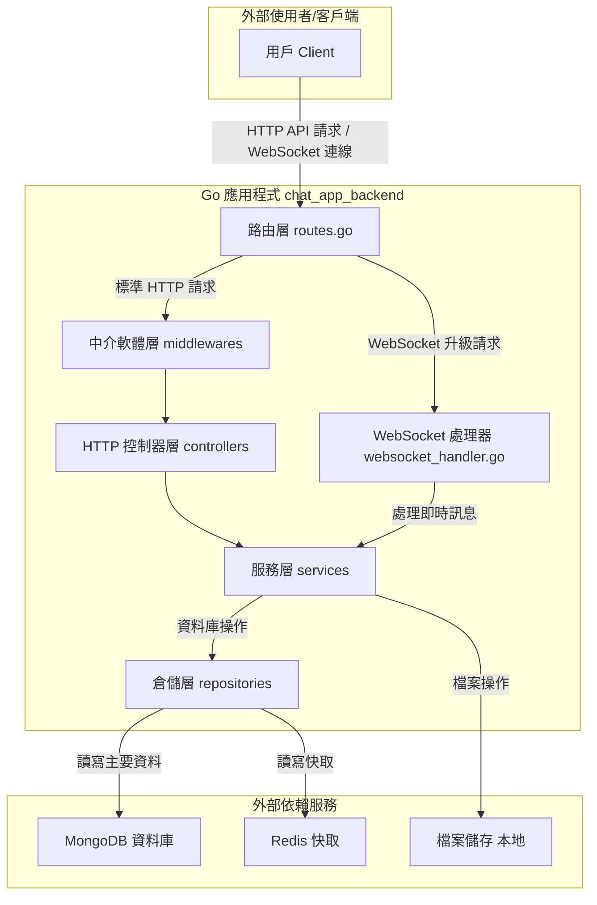

# chat_app_backend

[](https://go.dev/)
[](./docs/TEST_COVERAGE_SUMMARY.md)
[](./app/http/controllers)
[](./app/http/middlewares)
[](./app/services)
[](.)

## 專案簡介

本專案為一個即時聊天室後端，模仿 Discord 架構，支援伺服器（Server/Guild）、頻道（Channel/Room）、私訊（DM）、好友系統、檔案上傳等功能。採用 Go 語言開發，資料儲存採用 MongoDB，並整合 Redis 資料快取。

**專案特色：**

- ✅ 完整的單元測試覆蓋（整體覆蓋率 ~40%）
- ✅ Controller 層測試完成度 87.5%（7/8 已完成）
- ✅ Middleware 層測試覆蓋率 94.8%（優秀）
- ✅ 模組化架構設計（三層分離）
- ✅ WebSocket 即時通訊
- ✅ JWT 雙 Token 認證機制
- ✅ 集中化 Mock 測試架構（11 個可復用 Mock）
- ✅ 完整的 API 文檔
- ✅ Docker 容器化部署
- ✅ K6 負載測試支援

---

---

## 快速導航

- [📖 主要功能](#主要功能)
- [🛠 技術棧](#技術棧)
- [🏗 系統架構圖](#系統架構圖)
- [🚀 開發環境快速啟動](#開發環境快速啟動)
- [⚡ Makefile 指令速查](#makefile-指令速查)
- [📁 目錄結構](#目錄結構)
- [🧪 測試架構與覆蓋率](#測試架構與覆蓋率)
- [💡 開發規範](#開發規範)
- [❓ 常見問題](#常見問題)
- [🤝 貢獻指南](#貢獻指南)

---

## 主要功能

- **使用者帳號管理**

  - 註冊、登入、登出
  - JWT（Access/Refresh Token）驗證
  - CSRF Token 驗證（自訂 Gin Middleware）

- **好友系統**

  - 好友清單、邀請、狀態更新

- **即時聊天（WebSocket）**

  - 私訊（DM）與群組頻道
  - 房間動態建立與清理
  - 訊息歷史查詢
  - WebSocket 即時訊息推播

- **伺服器（Server/Guild）與頻道（Channel/Room）**

  - 伺服器/頻道建立、查詢
  - 權限與成員管理（預留）

- **檔案上傳**

  - 靜態路徑 `uploads/`，支援多檔案類型

- **系統架構**

  - 採用 `app` 目錄封裝核心業務邏輯
  - 三層分層架構：Controller → Service → Repository
  - 依賴注入（手寫 DI Container）
  - 配置集中管理（Viper + .env）
  - 集中化 Mock 測試架構（`app/mocks/`）

- **測試與品質保證**

  - 21 個測試文件，151 個測試函數，519 個測試場景
  - 整體測試覆蓋率 ~40%，100% 測試通過率
  - Controller 層：44.7% 覆蓋（7/8 已完成）
  - Middleware 層：94.8% 覆蓋（優秀）
  - Service 層：66.9% 覆蓋
  - Utils 層：59.7% 覆蓋
  - 使用 testify 框架（mock + assert）
  - 11 個集中化可復用 Mock
  - K6 負載測試腳本

- **資料庫**
  - MongoDB（官方 Driver）
  - Redis（狀態管理、快取）

---

## 技術棧

- **語言/框架**：Go 1.23+、Gin Web Framework
- **即時通訊**：gorilla/websocket
- **資料庫**：MongoDB (官方 Driver)
- **快取**：Redis (go-redis/v9)
- **驗證**：JWT (dgrijalva/jwt-go)
- **測試**：testify (mock + assert)
- **配置管理**：Viper + dotenv
- **其他**：
  - Docker Compose（開發環境）
  - CORS 支援（gin-contrib/cors）
  - 密碼加密（golang.org/x/crypto）

---

## 系統架構圖



---

---

## 開發環境快速啟動

### 🎯 使用 Makefile（推薦）

```bash
# 1. 初始化專案（首次使用）
make init

# 2. 配置環境變數
cp .env.example .env
# 編輯 .env 文件

# 3. 啟動開發環境
make dev

# 4. 查看日誌
make logs

# 5. 執行測試
make test

# 6. 查看所有可用指令
make help
```

### 🐳 傳統方式（Docker Compose）

```bash
# 1. 安裝依賴
go mod tidy

# 2. 配置環境變數
cp .env.example .env

# 3. 啟動服務（開發環境）
docker-compose -f docker-compose.dev.yml up -d

# 4. 查看日誌
docker-compose -f docker-compose.dev.yml logs -f
```

> **注意**：生產環境由 CI/CD 自動部署，不建議在本地執行生產環境。

### 💻 本地運行

```bash
# 1. 安裝依賴
go mod tidy

# 2. 確保 MongoDB 和 Redis 運行中

# 3. 配置環境變數
cp .env.example .env

# 4. 啟動應用
go run main.go

# 5. 運行測試
go test ./... -v
```

---

## ⚡ Makefile 指令速查

本專案提供完整的 Makefile **用於本地開發環境**。生產環境部署由 CI/CD 自動處理。

### 🔥 常用指令

```bash
# 環境管理
make dev              # 啟動開發環境
make dev-down         # 停止開發環境
make dev-restart      # 重啟開發環境
make logs             # 查看日誌
make status           # 查看容器狀態

# 測試
make test             # 執行單元測試
make test-coverage    # 執行測試並生成覆蓋率報告
make test-smoke       # k6 冒煙測試
make test-limit       # k6 極限測試
make test-ws          # WebSocket 壓力測試

# 開發工具
make shell            # 進入應用容器
make mongo-shell      # 進入 MongoDB shell
make redis-cli        # 進入 Redis CLI
make health           # 健康檢查

# 建置與 Go 開發
make build            # 建置映像
make rebuild          # 強制重建（無快取）
make fmt              # 格式化程式碼
make lint             # 程式碼檢查
make tidy             # 整理依賴

# 初始化
make init             # 初始化專案
make install-deps     # 安裝依賴
```

完整指令列表：`make help`

---

## 目錄結構

```text
chat_app_backend/
├── app/                      # 核心應用程式
│   ├── http/                 # HTTP 相關
│   │   ├── controllers/      # 控制器層（18% 測試覆蓋）
│   │   └── middlewares/      # 中介軟體（94.8% 測試覆蓋）
│   ├── services/             # 業務邏輯層（66.9% 測試覆蓋）
│   ├── repositories/         # 資料訪問層
│   ├── models/               # 資料模型
│   ├── providers/            # 資料庫連接提供者
│   └── mocks/                # 集中化測試 Mock（可復用）
├── config/                   # 配置管理
├── di/                       # 依賴注入容器
├── routes/                   # 路由配置
├── utils/                    # 工具函數（59.7% 測試覆蓋）
├── docs/                     # API 與測試文檔
├── backup/                   # 歷史文檔與優化記錄
├── loadtest/                 # K6 負載測試腳本
├── uploads/                  # 靜態檔案上傳目錄
├── docker-compose.dev.yml    # Docker 開發環境配置
├── docker-compose.prod.yml   # Docker 生產環境配置
└── main.go                   # 程式入口點
```

---

## 測試架構與覆蓋率

### 當前測試覆蓋率

| 模組            | 覆蓋率 | 測試文件 | 測試函數 | 狀態    | 說明                                                            |
| --------------- | ------ | -------- | -------- | ------- | --------------------------------------------------------------- |
| **Controllers** | 44.7%  | 7        | 40       | ✅ 良好 | UserController, ChatController, ServerController 等（7/8 完成） |
| **Middlewares** | 94.8%  | 4        | 9        | ✅ 優秀 | Auth, CSRF, CORS 等完整測試                                     |
| **Services**    | 66.9%  | 10       | 102      | ✅ 良好 | ChatService, UserService, ServerService 等                      |
| **Utils**       | 59.7%  | -        | -        | ✅ 良好 | Token, 加密等工具函數                                           |
| **整體**        | ~40%   | 21       | 151      | ✅ 優秀 | 519 個測試場景，100% 通過率                                     |

### 集中化 Mock 架構

所有測試 Mock 統一放在 `app/mocks/` 目錄，優點：

- ✅ **避免重複** - 一次實現，多處復用
- ✅ **統一維護** - 集中管理，易於更新
- ✅ **類型安全** - 使用 testify/mock 框架
- ✅ **完整覆蓋** - Service、Repository、Middleware 全覆蓋

**可用的 Mocks：**

```text
app/mocks/
├── auth_middleware_mock.go      # HTTP 認證測試 Mock
├── user_service_mock.go         # 用戶服務 (18 methods)
├── chat_service_mock.go         # 聊天服務 (6 methods)
├── server_service_mock.go       # 伺服器服務 (10 methods)
├── channel_service_mock.go      # 頻道服務 (5 methods) ⭐ NEW
├── friend_service_mock.go       # 好友服務 (10 methods)
├── file_upload_service_mock.go  # 檔案上傳服務
├── user_repository_mock.go      # 用戶數據層 Mock
├── server_repository_mock.go    # 伺服器數據層 Mock
├── friend_repository_mock.go    # 好友數據層 Mock
└── chat_repository_mock.go      # 聊天數據層 Mock

總計：11 個可復用 Mock，覆蓋所有核心業務邏輯
```

### 測試命令

```bash
# 運行所有測試
go test ./... -v

# 查看測試覆蓋率
go test ./... -cover

# 生成 HTML 覆蓋率報告
go test ./... -coverprofile=coverage.out
go tool cover -html=coverage.out

# 運行特定模組測試
go test ./app/http/controllers -v     # Controller 層測試
go test ./app/services -v              # Service 層測試
go test ./app/http/middlewares -v      # Middleware 層測試
go test ./utils -v                     # 工具函數測試
```

---

## 開發規範

### 測試規範

1. **單元測試**：所有新功能必須包含單元測試
2. **Mock 使用**：優先使用 `app/mocks/` 中的集中化 Mock（目前有 11 個）
3. **測試命名**：使用繁體中文描述測試場景
4. **覆蓋率目標**：
   - 新模組測試覆蓋率應 ≥60%
   - Controller 層目標 ≥50%（當前 44.7%）
   - Middleware 層保持 ≥90%（當前 94.8%）
   - Service 層保持 ≥60%（當前 66.9%）
5. **測試質量**：確保 100% 測試通過率

### 代碼風格

1. **分層架構**：嚴格遵守 Controller → Service → Repository 三層分離
2. **錯誤處理**：統一使用 `models.MessageOptions` 返回錯誤
3. **註解規範**：公開函數必須包含繁體中文註解
4. **依賴注入**：使用 `di/container.go` 管理依賴

---

## 常見問題

### Q: 如何添加新的 Mock？

A: 在 `app/mocks/` 目錄下創建新的 Mock 文件，繼承 `testify/mock.Mock`，參考現有 Mock 實現。

### Q: 測試時如何繞過認證？

A: 使用 `mocks.MockAuthMiddleware(userID)` 代替真實的認證中介軟體。

### Q: 如何運行負載測試？

A: 參考 `loadtest/` 目錄下的 K6 測試腳本，使用 `k6 run script.js` 執行。

---

## 貢獻指南

1. Fork 本專案
2. 創建功能分支 (`git checkout -b feature/AmazingFeature`)
3. 提交變更 (`git commit -m 'Add some AmazingFeature'`)
4. 推送到分支 (`git push origin feature/AmazingFeature`)
5. 開啟 Pull Request

**注意事項：**

- 確保所有測試通過 (`go test ./... -v`)
- 保持測試覆蓋率不降低
- 遵循現有的代碼風格和架構
- 更新相關文檔

---
