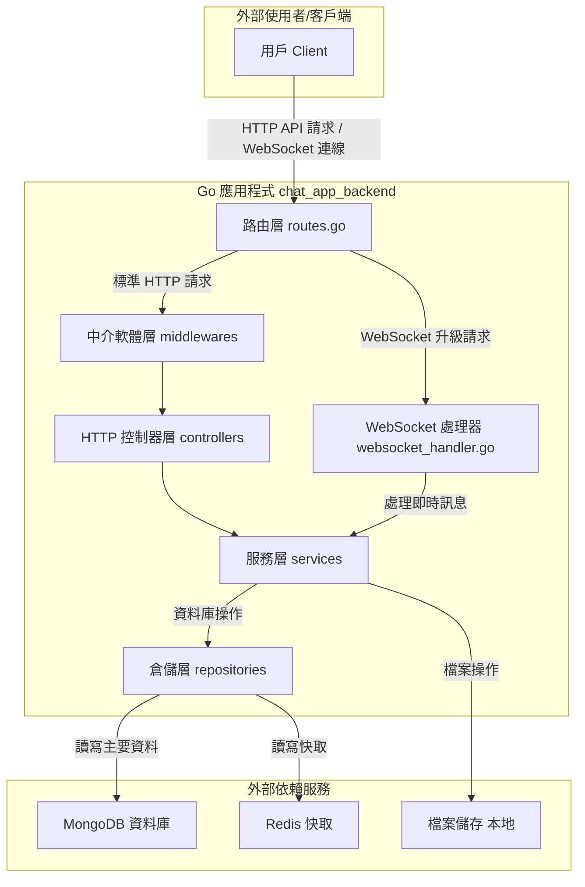

# chat_app_backend

## 專案簡介

本專案為一個即時聊天室後端，模仿 Discord 架構，支援伺服器（Server/Guild）、頻道（Channel/Room）、私訊（DM）、好友系統、檔案上傳等功能。採用 Go 語言開發，資料儲存採用 MongoDB，並整合 Redis 資料快取。

---

## 主要功能

- **使用者帳號管理**
  - 註冊、登入、登出
  - JWT（Access/Refresh Token）驗證
  - CSRF Token 驗證（自訂 Gin Middleware）

- **好友系統**
  - 好友清單、邀請、狀態更新

- **即時聊天（WebSocket）**
  - 私訊（DM）與群組頻道
  - 房間動態建立與清理
  - 訊息歷史查詢
  - WebSocket 即時訊息推播

- **伺服器（Server/Guild）與頻道（Channel/Room）**
  - 伺服器/頻道建立、查詢
  - 權限與成員管理（預留）

- **檔案上傳**
  - 靜態路徑 `uploads/`，支援多檔案類型

- **系統架構**
  - 採用 `app` 目錄封裝核心業務邏輯
  - 三層分層：Controller → Service → Repository
  - 依賴注入（手寫 DI）
  - 配置集中管理（Viper 讀取 ENV）

- **資料庫**
  - MongoDB（官方 Driver）
  - Redis（狀態、快取）

---

## 技術棧

- **語言/框架**：Go、Gin
- **即時通訊**：gorilla/websocket
- **資料庫**：MongoDB
- **快取**：Redis
- **驗證**：dgrijalva/jwt-go
- **設定管理**：Viper
- **其他**：Docker Compose（開發環境）、ttacon/chalk（終端色彩）

---

## 系統架構圖



---


## 開發環境快速啟動

1. 複製專案並安裝依賴
   ```bash
   git clone <repo_url>
   cd chat_app_backend
   go mod tidy
   ```

2. 啟動 MongoDB、Redis（建議用 Docker Compose）
   ```bash
   docker-compose up -d
   ```

3. 啟動後端服務
   ```bash
   go run main.go
   ```

4. 設定檔參考 `.env.example`，可自訂連線資訊

---

如需更詳細的設計、API 或貢獻方式，請聯絡專案維護者。
